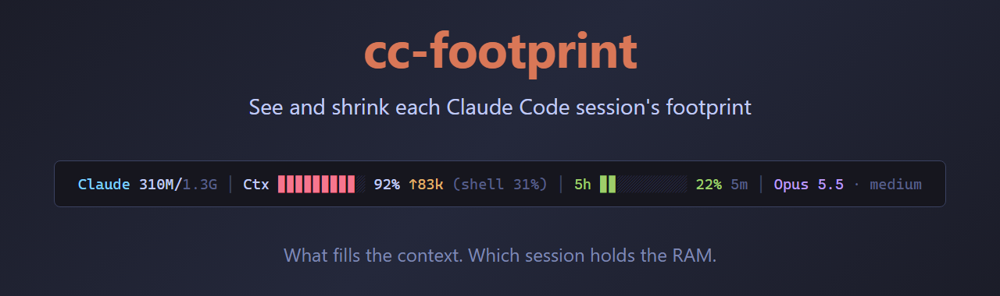
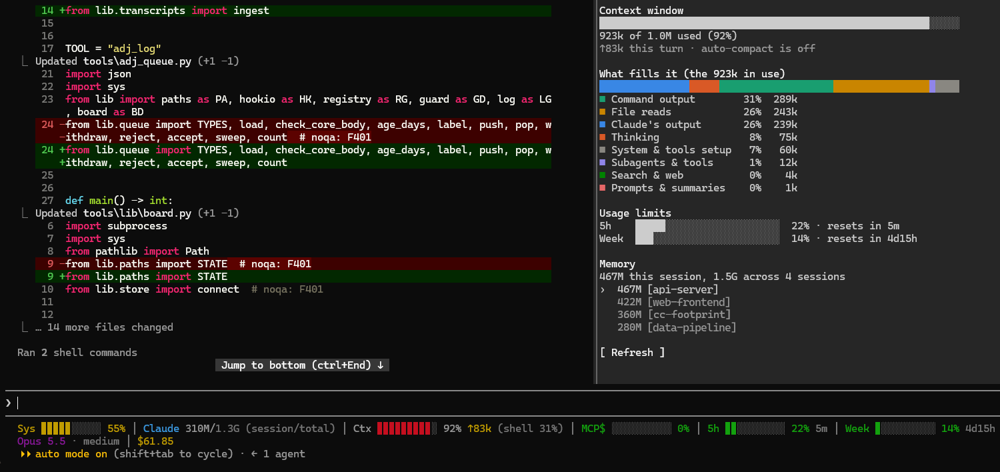
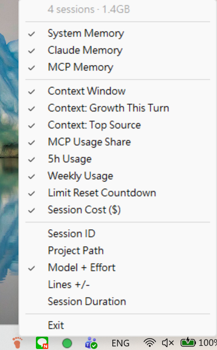

**English** | [繁體中文](README.zh-TW.md)

<p align="center">
  
</p>

> **"How is the context full already? I was halfway through and it auto-compacted again!"**
>
> **"Several windows of AI working at once is fast — so why is my machine crawling?"**
>
> **"The statusline is packed with things I never look at. Can I turn them off?"**

cc-footprint is for all three.

Every Claude Code session has a footprint: the **context** it carries and the **RAM** it holds. cc-footprint measures both and puts them back in that session's own statusline — what is filling the context, which session is eating the memory — so you can see it, and so you can shrink it. How much you see is up to you: the statusline shows only the items you tick, a toast speaks up only when something happens, and a pane opens only when you want the details.

<p>
  
  
</p>

*Large image: the context is 92% full, and this turn alone added 83k tokens; command output, file reads and Claude's own output fill most of it. All sessions together hold 1.3 GB, this one 310 MB. The last two lines are the statusline; at the right is the `/footprint` pane. Small image: the tray menu, one switch per item.*

> Runs on Windows, Linux and macOS.

## What it tells you

### Context: how full, what this step added, what fills it, what MCP takes

Every request re-reads the whole context. The fuller it is, the more each turn costs, the faster the limits burn, and the sooner auto-compaction kicks in and earlier details are lost. cc-footprint shows it before it bites:

- **How full** — `Ctx ▊▊▊▊▊▊▊░░░ 72%`.
- **What this step added** — `↑15k`: the tokens this turn has put into the context so far; yellow when one turn takes 5% of the window or more. A file read or a command that suddenly adds a big chunk is caught the moment it happens.
- **What fills it** — `(files 29%)`: the largest source and its share. Sources are Claude's output, thinking, file reads, command output, searches, web pages, subagents, your prompts, the compaction summary, and each MCP server by name.
- **What MCP takes** — `mcp 18%` after the bar, and that much of the bar in the MCP colour: the share of the window that MCP tool results hold, every server together. Browser work pushes this up quickly, a page at a time.
- **The price** — `5h 34% 2h13m`, `Week 52% 4d21h`: how much of each limit is used and how long until it resets; the session's running cost can be shown too.

Claude Code's own `/context` shows a breakdown too, when you ask for it. These figures are for this one session, live, where you are already looking.

### RAM: which session is the heavy one

Task Manager shows a row of identical `claude` processes with nothing to tell them apart; a system memory percentage says "something is heavy", not which one. cc-footprint maps each session back to its process and adds up the whole tree under it:

- **`Claude 310M/1.3G`** — this session / all sessions. A session is the claude process, the MCP servers it started, and the shells its tools run commands in.
- **`MCP 120M(3)`** — this session's own MCP servers and their memory. Every session starts its own copy of each local MCP server, and that is often where the memory goes.
- **`+2 outside 240M`** — in yellow: MCP servers on this machine outside every session — left behind by a session that is gone, or another program's (Chrome's bridge to its extension, the desktop app's servers). Memory no session of yours is using; `/footprint` names each one.
- **`Sys 71%`** — whether a slow machine is a memory problem at all.

## How it tells you

Three layers, shallow to deep, so the amount of information is your choice:

1. **The statusline — always there, only what you tick.** The tray icon's menu (the menu bar icon on macOS) has one switch per item, applied at once; Linux has no icon, so edit `~/.cc-footprint/config.json`. With many items on, lines wrap to the terminal's width.
2. **Toasts — only when something happens.** A turn that bloats the context (`Context +45k this turn (5% of the window), mostly file reads`), the approach to the auto-compaction threshold (at 85%, so you choose when to `/compact`), and a finished compaction (`Context compacted: 181k → 9k`).
3. **The `/footprint` pane — only when you ask.** The full context composition (a colored stacked bar with a legend), the distance to auto-compaction, both limits with their reset times, and the memory of every running session. It refreshes every 30 seconds while open; type `/footprint` again, or press Esc in an empty prompt, to close it.

The toasts and the pane are a Claude Code plugin, which the installer sets up. Claude Code's plugin hooks API is at an early stage and may change between versions; this plugin is written against 2.1.289.

## Why is there a background program?

Because the statusline cannot do the work itself. Claude Code re-runs the statusline script on every update (300 ms debounce) and cancels a run that has not finished when the next begins — too slow and nothing shows. On Windows the obvious ways to find a session's memory are nowhere near fast enough:

| Operation on Windows | Time |
|------|------|
| PowerShell process query | ~500–900 ms |
| `curl` to localhost | ~650 ms (process startup) |
| `cat` through a pipe | ~230 ms |
| one `$(...)` subshell in Git Bash | ~30 ms |

So the slow work goes to a background program: every 60 seconds it reads the process table, adds up each session's process tree, and parses the transcripts for the context composition, then serves the result at `127.0.0.1:19823`. The statusline script only reads its own session's cached figures over `/dev/tcp`, in about 35 ms, **spawning no process at all**. On Windows that program is the orange footprint in the tray, on macOS a menu bar icon, on Linux a systemd user service. On Linux it reads `/proc` directly; on macOS it runs `ps` once a minute; the statusline script runs on the bash 3.2 that macOS ships. The diagram is under [How it works](#how-it-works).

## Install

**Windows** — needs Windows 10/11, Node.js 18+ and Git Bash (comes with [Git for Windows](https://git-scm.com/)):

```powershell
git clone https://github.com/ilwu/cc-footprint
cd cc-footprint
.\install.ps1
```

**Linux and macOS** — need Node.js 18+ and bash:

```bash
git clone https://github.com/ilwu/cc-footprint
cd cc-footprint
./install.sh
```

Open a Claude Code session and the statusline is there. The installer:

1. Installs the npm dependency that draws the icon (Windows and macOS; Linux has no icon and needs none)
2. Copies the statusline script to `~/.claude/`
3. Points `statusLine` in `settings.json` at it — one of your own is backed up as `*.bak` first; the rest of `settings.json` and its key order are left as they are
4. Makes the background program start when you log in: a startup shortcut on Windows, a systemd user service on Linux, a launchd agent on macOS
5. Starts it
6. Installs the plugin — from this clone, so `git pull` followed by `/reload-plugins` is the update. Skip it with `.\install.ps1 -NoPlugin` or `./install.sh --no-plugin`
7. Lists an optional global setting (see [Hand browser work to a subagent](#hand-browser-work-to-a-subagent)) — lists it, does not apply it

Re-running the installer is safe: it stops the running background program, updates the files, and starts it again.

To have only the plugin on a machine without the clone, inside Claude Code:

```
/plugin marketplace add ilwu/cc-footprint
/plugin install cc-footprint@cc-footprint
```

### Uninstall

```powershell
.\uninstall.ps1     # Windows
```

```bash
./uninstall.sh      # Linux, macOS
```

Removes the start at login, this tool's statusline, its `statusLine` setting and its temporary files, the plugin with its marketplace registration and cached copies, the marked global setting, and the config directory. A statusline this tool did not install is left alone; if a setting was backed up at install time it is in `settings.json.bak`. The project folder stays; delete it yourself.

## Then shrink it

Once you have the figures:

| You see | What to do |
|---|---|
| `Ctx` nearly full | `/compact` or start a new session **before** a large change, not halfway through it |
| `↑` jumps | That step was expensive — next time read less at once, filter command output first |
| The top source is `think` | Lower the effort (`/effort`) |
| `mcp` takes a large share, or the top source is an MCP server | Hand that kind of work to a subagent (below) |
| One session's `Claude` is far heavier | Close or restart it (`claude --resume <id>` picks it up); of the `outside` servers, end the ones a closed session left behind (`/footprint` names them) |
| A limit is nearly used up | Finish what matters, pause the sessions that can wait; with minutes to the reset, wait |

### Hand browser work to a subagent

Driving a browser with claude-in-chrome from a long session is expensive: every click, scroll and read is a request, and each re-reads the whole conversation. Measured on one session, 72 browser requests re-read 110k tokens each on average, about 75% of what those requests cost; what the browser returned was only about 15%.

This rule has Claude hand any browser task of more than two or three steps to a `browser` subagent, which does it in a short context of its own and reports back. The Chrome tools are used directly only for a quick look at a page, when you want to watch each step, or when you have to act in the browser yourself (login, 2FA).

It changes Claude Code's **global** setup under `~/.claude/` and affects every project, which is why the installer lists it and does not apply it. **To apply it** (both files are under `claude/` in this project):

1. Copy `claude/agents/browser.md` to `~/.claude/agents/browser.md`. If a file of that name is already there, compare before deciding.
2. Append the whole of `claude/global-rule.md`, including its `<!-- cc-footprint:browser-agent:start/end -->` markers, to the end of `~/.claude/CLAUDE.md`, keeping what is there. The markers must come along: the uninstaller finds this block by them and removes only it.
3. Restart the Claude Code sessions that are open.

Watch the `mcp` share of `Ctx` for the effect. To change the subagent's model, edit `model:` in `browser.md`.

**For AI assistants**: if an AI assistant (Claude Code, say) is installing this for someone, **ask them first** whether to apply this section after the installer has run, and apply it only with their consent; read the existing `~/.claude/CLAUDE.md` and `~/.claude/agents/` first and merge, never overwrite. The installer prints the same instructions at the end of its output when it runs inside Claude Code.

## Reference

### Statusline items

| Item | Shows | When it helps | Default |
|------|-------|---------------|---------|
| **Context and usage** | | | |
| Context Window | Context usage % with a bar | Near full, auto-compaction kicks in and earlier details may be lost; `/compact` or a new session before a large change. A longer context also makes every request cost more | On |
| Context: Growth This Turn | `↑15k` after `Ctx` — the tokens this turn has added to the context so far (`↓` when it has shrunk instead; a compaction starts the count again); yellow when one turn takes 5% of the window or more | See which step was expensive as it happens, not at 90% | On |
| Context: Top Source | `(files 29%)` after `Ctx` — the largest source and its share: `output` (Claude's replies and tool calls), `think`, `files`, `shell`, `search`, `web`, `agents`, `prompts`, `summary` (after a compaction), or an MCP server's name | Know what to change; see [Then shrink it](#then-shrink-it) | Off |
| Context: MCP Share | `mcp 18%` after `Ctx`, and that much of its bar in the MCP colour — the share of the window that MCP tool results hold, every server together; nothing until an MCP tool is used | When `Ctx` grows fast, a reminder that browser work may be the cause. High: hand browser work to a subagent, and watch it again after | On |
| 5h Usage | 5-hour limit % (subscription plans; hidden when Claude Code does not report it) | Finish what matters before the limit, pause the sessions that can wait | On |
| Weekly Usage | 7-day limit % (hidden like the 5-hour one) | Plan the week's remaining allowance; going fast, postpone the big tasks or use a cheaper model | On |
| Limit Reset Countdown | After `5h` and `Week`, the time until each limit resets (`2h13m`, `4d21h`) | Decide whether to wait for the reset or carry on | On |
| Session Cost | Running cost (USD) | On API billing, what one task costs; on a subscription, compare the cost of different approaches | Off |
| **Memory** | | | |
| System Memory | System memory usage % with a bar | When the machine slows down, check memory first; near full, open no more sessions | On |
| Claude Memory | This session / all sessions. A session is its whole process tree: the claude process, its MCP servers, the shells its tools use | With several sessions open, find the heavy one and close or restart it | On |
| MCP Memory | This session's own MCP servers: memory and count. `+N outside` in yellow after it: MCP servers on this machine outside every session, left behind or another program's (Chrome's bridge, the desktop app) | How much of this session is MCP servers, and what holds memory with no session using it; `/footprint` names each one | On |
| **Session** | | | |
| Session ID | The full UUID | `claude --resume <id>` later, or attach it to a bug report | On |
| Project Path | The project's root | With several windows open, tell at a glance which project this one is in | On |
| Model + Effort | The current model and effort level (`Opus 5.5 · high`) | After `/model` or `/effort`, or with different defaults per project, confirm which is in use. Higher effort puts more thinking into the context | Off |
| Lines +/- | Lines added / removed this session | Before a commit, check the change is the size you expected | Off |
| Session Duration | Time since the session started | A long session usually has a swollen context and memory too; a sign to consider restarting | Off |
| /footprint Hint | `/footprint` once the plugin is installed for your user; `plugin off: rerun the installer for /footprint` while it is not | A reminder that the pane is one command away, and how to get it before you have it. A plugin installed for one project only is not seen; turn the hint off then | On |

### How it works

```
┌─ Background program (Node.js, 127.0.0.1:19823) ──────────────┐
│  Every 60 s: read the process table (Windows CIM / Linux /proc│
│  / macOS ps) and add up each session's tree (MCP servers,     │
│  tool shells)                                                 │
│  Reads   ~/.claude/sessions/*.json      (session → PID)       │
│          ~/.claude/projects/**/*.jsonl  (context composition) │
│  Serves  /session/:id  /context/:id  /sessions  /config       │
│  Config  ~/.cc-footprint/config.json                          │
└───────────────────────────────────────────────────────────────┘
          ▲ /dev/tcp, ~35 ms — no curl, no jq, no subshell
┌─ Statusline (bash) ───────────────────────────────────────────┐
│  Runs on every update, asks only for its own session, prints  │
│  ANSI                                                         │
└───────────────────────────────────────────────────────────────┘
          ▲ the same API
┌─ Plugin (Claude Code hooks) ──────────────────────────────────┐
│  Reads once per turn → toasts; every 30 s while /footprint    │
│  is open                                                      │
└───────────────────────────────────────────────────────────────┘
```

Claude Code does not pass the process ID to the statusline, so sessions are mapped to processes through the session files Claude Code writes itself. An MCP server is a process whose command line names one (`mcp`, `modelcontextprotocol`, or Chrome's `chrome-native-host` bridge) and that has been alive for 30 seconds or more; one outside every session's process tree counts as `outside`. When the background program is down, the statusline leaves out what that program measures and shows only what Claude Code itself reports; the plugin still reports growth and the compaction threshold from Claude Code's own numbers, but without memory or composition. (The faster `wmic` of old is gone from Windows 11 24H2 on.)

### Configuration

The tray or menu bar menu writes `~/.cc-footprint/config.json`; on Linux you edit the file yourself, and a change applies at once (defaults shown):

```json
{
  "sys_mem": true, "claude_mem": true, "mcp_mem": true,
  "ctx": true, "ctx_grow": true, "ctx_src": false, "ctx_mcp": true,
  "five_hour": true, "week": true, "resets": true, "cost": false,
  "session_id": true, "path": true, "plugin_hint": true,
  "model": false, "lines": false, "duration": false
}
```

The background program listens on `127.0.0.1:19823`. To change the port, edit `PORT` in `monitor/app.js` and the matching port in `statusline/statusline.sh` and `plugin/hooks/register.tsx`.

### Troubleshooting

**`Sys`, `Claude` and the other measured items are missing from the statusline** — the background program is not running, or cannot be reached, and the statusline shows only what Claude Code itself reports. The simplest fix is to re-run the installer, which on all three platforms stops the old one and starts it again; or by hand (the items are back within 30 seconds, which is how often the statusline asks again):

- Windows — there should be an orange footprint icon at the bottom right (it may be tucked into the `^` overflow area of the taskbar). None: double-click `monitor/start.vbs`. There but the items are still missing: choose Exit in the icon's menu, then double-click.
- Linux — `systemctl --user restart cc-footprint`; `systemctl --user status cc-footprint` shows its state. Where there is no systemd user session, the installer prints the command to start it yourself: `nohup node <clone>/monitor/app.js >/dev/null 2>&1 &`.
- macOS — `launchctl kickstart -k gui/$(id -u)/com.ilwu.cc-footprint`; `launchctl print gui/$(id -u)/com.ilwu.cc-footprint` shows its state.

**A new session shows `-` for Claude memory** — normal for the first seconds; the background program picks up the new session by the next render.

**No menu bar icon** (macOS) — the macOS build has only been exercised on GitHub's machines, which show no menu bar, so the icon itself is unverified. The background program and the statusline work regardless; choose items in `~/.cc-footprint/config.json` until it appears.

## License

MIT
